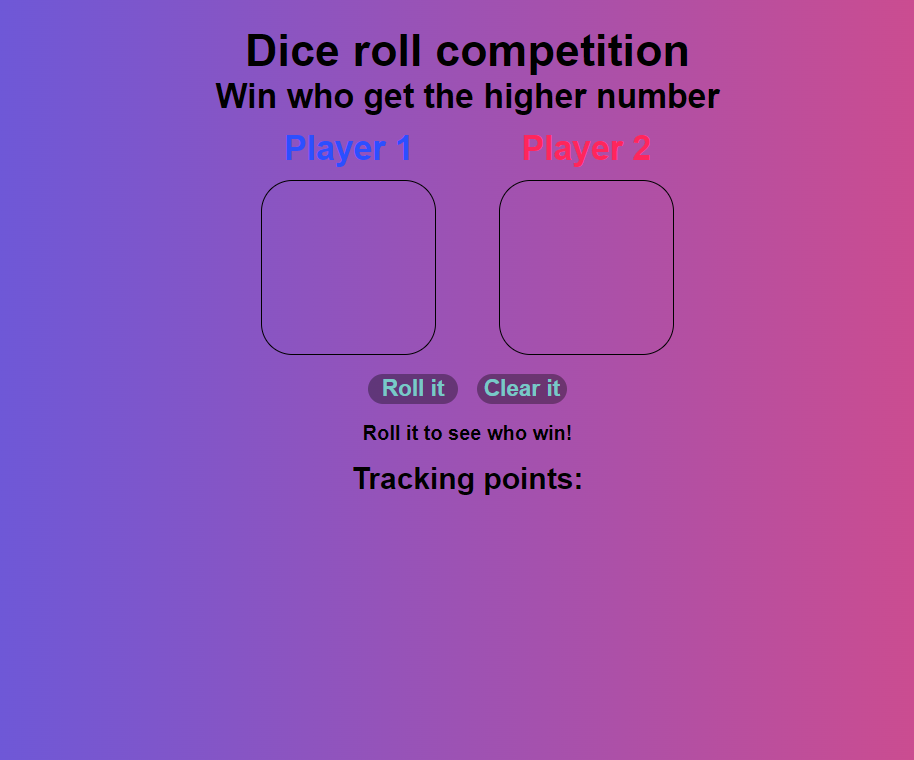

# Dice-roll-game

The objective was to do a dice game. Two players will roll two different dices, and the player who rolls the higher number won a round.

Under the button to roll, have a tracking points history. There will be allocated all matches, but stacked one under another.

## Preview image

## Used stacks

, , , , , 

## Author

Hugo Teixeira da Silva - 8Dev - Djbetamax

 -  - 
